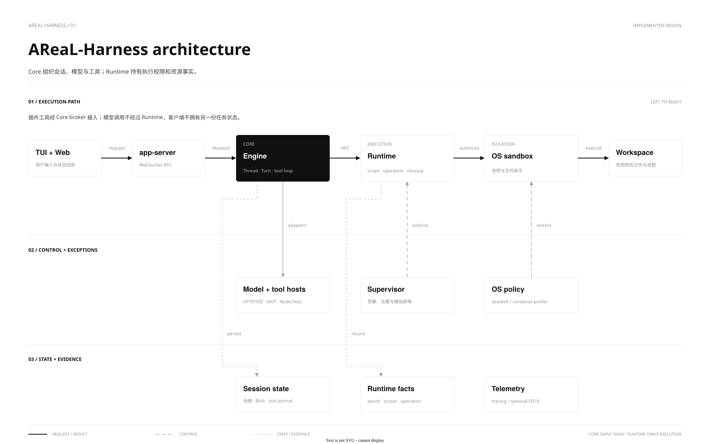

**中文** | [English](architecture.en.md)

# 架构与目录

AReaL-Harness 采用 **Clients → Core → Runtime** 分层。Core 是会话、Turn、模型循环与 Agent 状态的唯一所有者；Runtime 只处理执行权限、操作事实和资源生命周期。客户端不维护另一套权威历史。



[draw.io 源文件](diagrams/architecture.drawio) · [PNG](diagrams/architecture.png) · [图表规范](STYLE_GUIDE.md)

## 模块职责

| 模块 | 职责 |
|---|---|
| `clients/cli`, `clients/tui`, `clients/web` | CLI、终端和本地 Web；初始化连接、显示投影与提交请求 |
| `core/config` | 解析用户配置、来源、凭据引用和 Skill 目录；不依赖 Engine 或 Runtime |
| `core/protocol` | 客户端协议投影和共享类型 |
| `core/engine` | 模型、工具、历史、持久化、父子任务和 Workgroup |
| `core/app-server` | WebSocket、认证、订阅、回调关联；不拥有另一份历史 |
| `core/server` | 装配配置、模型、MCP、Host、Runtime 和关闭流程 |
| `core/mcp` | 官方 rmcp 客户端与结果适配，不拥有 Turn |
| `core/sdk-typescript` | 选定 DSH 工具/文件服务适配和独立 Node Host |
| `runtime/protocol`, `runtime/client` | 独立执行契约与 Rust 私有管道客户端 |
| `runtime/supervisor` | Scope、权限收窄、祖先预算、去重与清理 |
| `runtime/exec-native`, `runtime/fs-helper` | OS 沙箱、进程/PTY 与描述符文件操作 |
| `runtime/daemon` | 二进制、Cordis 装配与私有 RPC |
| `runtime/sdk-typescript` | 可信宿主独占连接的底层 Node.js SDK |

`supervisor` 依赖 `protocol`，`exec-native` 实现 Supervisor 后端接口，daemon 负责装配。Engine 不依赖 app-server 或客户端；配置由 server 解析并注入，SDK 不自行寻找用户配置。

Skill 发现由 `core/config` 根据可信启动参数执行，只返回元信息和独立告警；其无状态文件头解析器由 Engine 的显式部署登记复用。Engine 不自行查找用户配置。`core/engine/src/desktop/skills.rs` 保存登记目录描述符，异步、有界地读取当前资源，不持有 Skill 内容快照。配置与读取契约见 [Skill 指南](../guides/skills.md)。

## 状态与执行

同一 Thread 的变更串行，不同 Thread 可并发。模型请求、工具等待及子任务等待不跨等待持有会话锁。模型许可不跨工具执行持有，活动 Turn、模型请求和 OS 进程是独立限额。

工具先持久化意图，再提交 Runtime 或外部宿主，确认后记录结果。快照保存权威历史，媒体存入按 SHA-256 寻址的 Blob。重启将未完成执行标为 UNKNOWN；不自动重放。归档释放热历史，drain 后 GC 按引用回收 Blob。

普通[Agent 委派](multi-agent.md)共享工作区、独立上下文；[Workgroup](workgroups.md)使用隔离写工作区并验证制品。Core 管调度，Runtime 不选择并行宽度。插件、stdio MCP 与 Core 仍是可信宿主；broker 权限不等于 Host OS 隔离，见[插件边界](plugins.md)。

可选[研究 Agent](../guides/tools.md#research-agents)由 Core 管理只读源码、私有 scratch 与共享预算，默认异步派发，是否委派由模型决定。短句柄缓存属于活动 Turn，压缩保留、结束失效；Store 继续保留原始执行历史。模型 HTTP 层记录脱敏参数与用量，未完成响应恢复不重放已执行工具，见 [Core API](../api/core.md#recovery)。

## 仓库目录

```text
core/                       配置、协议、Engine、server、MCP、插件 SDK
clients/                    CLI、TUI、本地 Web
runtime/                    协议、监督器、OS 后端、文件助手、SDK
schemas/                    固定上游与 AReaL 机器契约
examples/desktop-api/        直接 API、CLI 与发行验收
scripts/                    构建、检查、启动与 smoke
upstream/pins.json          上游来源与固定版本
tests/fixtures/             确定性工具、hooks、MCP
tests/e2e/docker/           Linux 受控执行镜像
tests/perf/                 lite/pro、runner、grader 与统计
tests/perf/suites/pro/cases/*/environment/  公开 Dockerfile、原始输入与运行库校验
docs/guides/               使用与配置
docs/api/                  接口契约
docs/design/               分层、机制及 diagrams/ 源文件与预览
docs/development/          开发、测试与依赖维护
docs/examples/             示例说明
docs/benchmarks/           运行方法与 reports/ 历史报告
```

接口细节见 [Core](../api/core.md)、[Runtime](../api/runtime.md) 与 [SDK](../api/typescript-sdk.md)。当前范围见[功能清单](../features.md)，验证入口见[测试](../development/testing.md)。
