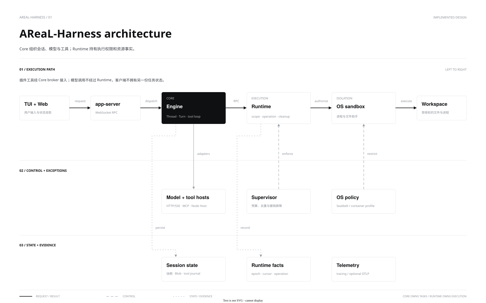

**中文** | [English](architecture.en.md)

# 架构与目录

AReaL-Harness 采用 **Clients → Core → Runtime** 分层。Core 是会话、Turn、模型循环与 Agent 状态的唯一所有者；Runtime 只处理执行权限、操作事实和资源生命周期。客户端不维护另一套权威历史。



[draw.io 源文件](diagrams/architecture.drawio) · [PNG](diagrams/architecture.png) · [图表规范](STYLE_GUIDE.md)

## 模块职责

| 模块 | 职责 |
|---|---|
| `clients/cli`, `clients/tui`, `clients/web` | CLI、终端和本地 Web；初始化连接、显示投影与提交请求 |
| `clients/gui` | React/Electron 桌面客户端；窄 IPC、原生资源、公开服务发现与可重建投影 |
| `core/config` | 解析用户配置、来源、凭据引用和 Skill 目录，定义工具宿主的代理环境白名单；不依赖 Engine 或 Runtime |
| `core/protocol` | 客户端协议投影和共享类型 |
| `core/engine` | 模型、工具、历史、持久化、父子任务和 Workgroup |
| `core/app-server` | WebSocket、认证、订阅、回调关联；不拥有另一份历史 |
| `core/local-service` | 共享服务发现、配置兼容性和控制客户端，只依赖 config/protocol |
| `core/service-host` | Rust 可信 launcher 和独立本地服务宿主，管理 Core/Runtime 生命周期与私有管道 |
| `core/server` | 装配配置、模型、MCP、Host、Runtime 和关闭流程 |
| `core/mcp` | 官方 rmcp 客户端与结果适配，不拥有 Turn |
| `core/sdk-typescript` | 选定 DSH 工具/文件服务适配和独立 Node Host |
| `runtime/protocol`, `runtime/client` | 独立执行契约与 Rust 私有管道客户端 |
| `runtime/supervisor` | Scope、权限收窄、祖先预算、去重与清理 |
| `runtime/host-tools` | Core 与原生后端共用的可信宿主工具发现；不执行任务、不授予权限 |
| `runtime/exec-native`, `runtime/fs-helper` | OS 沙箱、进程/PTY 与描述符文件操作 |
| `runtime/daemon` | 二进制、Cordis 装配与私有 RPC |
| `runtime/sdk-typescript` | 可信宿主独占连接的底层 Node.js SDK |

`supervisor` 依赖 `protocol`，`exec-native` 实现 Supervisor 后端接口，daemon 负责装配。Engine 不依赖 app-server 或客户端；配置由 server 解析并注入，SDK 不自行寻找用户配置。

Linux `exec-native` 为每次执行启动同 crate 提供的独立 Rust 二进制 `areal-runtime-reaper`，由它作为 subreaper 拥有实际命令及被收养后代的等待与回收；Runtime 等待 helper 并核验私有退出/清理回执。helper 与 daemon、文件助手一同发布在 `libexec/areal`，不依赖 Python。macOS 在进程组清理之外，使用 `libproc` 跟踪和清退已观察到的后代。这些职责不放入 Core 模型循环，也不替代外层服务管理器或容器 init；平台差异与保证边界见 [Runtime 清理契约](../api/runtime.md#输出与清理)。

Engine 的 `trajectory` 模块记录模型和工具的执行内容，通过 `tracing` 暴露轨迹；server 的 `telemetry` 模块装配标准 OpenTelemetry Traces/Logs SDK 和 OTLP 导出。Engine 不读取遥测环境变量，也不依赖上报后端；配置见[轨迹上报](../guides/configuration.md#opentelemetry-轨迹上报)。

Skill 发现由 `core/config` 根据可信启动参数执行，只返回元信息和独立告警；其无状态文件头解析器由 Engine 的显式部署登记复用。Engine 不自行查找用户配置。`core/engine/src/desktop/skills.rs` 保存登记目录描述符，异步、有界地读取当前资源，不持有 Skill 内容快照。配置与读取契约见 [Skill 指南](../guides/skills.md)。

Goal 模式由 `core/engine/src/goals` 管理持久目标、请求账本与跨 Turn 续轮；用户队列与自动续轮共用准入入口。Clients 只维护投影，Runtime 沿用原执行边界。接口见 [Core API](../api/core.md#goals)。

交互式 TUI 与 Web 启动入口连接到同一部署服务；宿主独立于窗口存活，Store 保持单写者锁。Desktop Main 可直接复用发现与控制入口，见[本地服务契约](../api/local-service.md)。

Task Mode 由 `core/engine/src/task_mode` 管理 Task/TaskRun、定时触发、独立 Channel 和 worker。它复用 Goal 账本与 Thread 准入，通信状态由 Core 持有；Inbox 是授权问题的查询投影。TaskRun worker 可跨协调 Turn，在独立 Session 中执行，仍由 Core 负责取消和结算。接口见 [Task 契约](../api/tasks.md)。


[draw.io 源文件](diagrams/task-mode-mailbox-architecture.drawio) · [异步交互流程](diagrams/task-mode-mailbox-flow.svg) · [流程源文件](diagrams/task-mode-mailbox-flow.drawio)

`clients/cli` 提供 Rust 命令入口 `areal`，分派到 TUI、非交互客户端、Core server 和服务宿主的库入口；Core 不依赖客户端。`core/service-host` 的 Rust launcher 持有独立 Core/Runtime 进程与私有生命周期管道，Linux 不依赖 Python；macOS 沿用 `/usr/bin/python3` 中转启动 Runtime，以满足本地可执行文件的 AMFI 启动约束。`scripts/launch.py` 保留用于开发脚本与独立评测入口。发行目录 `bin` 只含 `areal`，Runtime daemon/file helper 放在 `libexec/areal`，不并入客户端进程。命令契约见[客户端指南](../guides/clients.md)。

## 状态与执行

同一 Thread 的变更串行，不同 Thread 可并发。模型请求、工具等待及子任务等待不跨等待持有会话锁。模型许可不跨工具执行持有，活动 Turn、模型请求和 OS 进程是独立限额。

工具先持久化意图，再提交 Runtime 或外部宿主，确认后记录结果。Store 的热快照与不可变 SHA-256 历史分段共同保存权威历史；先同步冷分段再提交快照引用，模型仅使用有界 checkpoint 与近期原文。媒体和大工具结果原文存入按 SHA-256 寻址的 Blob；工具结果引用由所属 Thread 的调用记录授权，模型投影只生成一次并随历史持久化。重启将未完成执行标为 UNKNOWN；不自动重放。归档释放热历史，drain 后 GC 按引用回收 Blob。

普通[Agent 委派](multi-agent.md)共享工作区、独立上下文；[Workgroup](workgroups.md)使用隔离写工作区并验证制品。Core 管调度，Runtime 不选择并行宽度。插件、stdio MCP 与 Core 仍是可信宿主；broker 权限不等于 Host OS 隔离，见[插件边界](plugins.md)。

可选[研究 Agent](../guides/tools.md#research-agents)由 Core 管理只读源码、私有 scratch 与共享预算，默认异步派发，是否委派由模型决定。短句柄缓存属于活动 Turn，压缩保留、结束失效；Store 继续保留原始执行历史。模型 HTTP 层记录脱敏参数与用量，未完成响应恢复不重放已执行工具，见 [Core API](../api/core.md#recovery)。

`core/engine/src/model/tool_calls.rs` 统一请求级工具缓冲预算与脱敏诊断；Engine 提供执行额度，模型适配器在积累响应时约束资源。媒体自动无损压缩应由模态预处理负责，并单独验证还原一致性；当前工具缓冲预算按原始 UTF-8 字节计量，不触发媒体压缩。

Engine 的 `diagnostics` 模块对非权威排障制品执行有界保留，server 装配启动与周期清理；service-host 管理宿主/launcher 日志与握手临时目录的租约回收。诊断回收不改变历史与 Goal 账本的恢复语义，策略见 [Core API](../api/core.md#recovery) 和 [本地服务契约](../api/local-service.md)。

## 仓库目录

桌面客户端归属见[迁移决策](../adr/0001-desktop-client-module.md)。`clients/gui` 的独立 Electron 适配器保留系统凭据与订阅转发，通过共享服务公共入口连接 Core；退出 GUI 不终止 Core 任务。GUI 构建、数据隔离与本地包见 [GUI 指南](../../clients/gui/README.md)。移动端源码后续迁移。

桌面适配器的项目连接所有者管理退避、连接身份和快照重订；被动恢复只连接兼容的运行中服务，不启动或重启 Core、不重放未知提交。Workbench 共享桌面能力契约，Main 和服务入口校验各自允许的能力并保留结构化错误；Core 仍拥有配置和执行的最终校验。原生预览归 Electron Main，按项目/Thread 释放并有界缓存页面；界面仅保留可重建的 URL。具体恢复、类型覆盖及页面状态丢失边界见 GUI 指南的生命周期章节。

```text
core/                       配置、协议、Engine、server、MCP、插件 SDK
clients/                    CLI、TUI、本地 Web、GUI
runtime/                    协议、监督器、OS 后端、文件助手、SDK
schemas/                    固定上游与 AReaL 机器契约
examples/desktop-api/        直接 API、CLI 与发行验收
scripts/                    构建、检查、启动与 smoke
upstream/pins.json          上游来源与固定版本
tests/fixtures/             确定性工具、hooks、MCP
tests/e2e/docker/           Linux 受控执行镜像
tests/perf/                 lite/pro、runner、grader 与统计
tests/perf/suites/pro/cases/*/environment/  公开 Dockerfile、原始输入与运行库校验
docs/guides/               使用与配置
docs/api/                  接口契约
docs/design/               分层、机制及 diagrams/ 源文件与预览
docs/development/          开发、测试与依赖维护
docs/examples/             示例说明
docs/benchmarks/           运行方法与 reports/ 历史报告
```

接口细节见 [Core](../api/core.md)、[Runtime](../api/runtime.md) 与 [SDK](../api/typescript-sdk.md)。当前范围见[功能清单](../features.md)，验证入口见[测试](../development/testing.md)。

Core server 负责配置监听与模型装配，Engine 在提交时固定模型版本并保留队列快照；本地服务客户端负责安全重启与发现，Runtime 权限仍属于部署边界。见[配置指南](../guides/configuration.md)。

Core `permissions` 负责审批模式、规则优先级与精确请求记忆；Clients 展示并回答请求。Runtime 独立执行部署上限及 Scope 收窄，本地 full-access 由可信 launcher 选择。见[权限配置](../guides/configuration.md#permissions)。

`integrations/envarena` 提供原生发布包的 runner 适配源码，只投影 Core 终止原因和收集制品，不维护模型循环。返回值契约见 [Core API](../api/core.md#结构化终止原因)。

模型目录的解析、校验、凭据状态诊断和受控文件写入归 `core/config`，`core/server` 在启动时装配为 Engine 的执行投影，并复用凭据解析规则。Clients 使用公开配置命令，不复制 TOML 解析或凭据规则；桌面安全存储只在可信适配器中提供密钥及注入来源信息，由 Core 返回凭据来源和就绪状态；Renderer 不读取密钥。“无需认证”复用共享文件中不配置凭据引用的语义，不建立另一份供应商配置。GUI 默认与 CLI 共用用户配置文件；独立服务登记目录由 `core/local-service` 选择，不改变配置查找，运行数据仍按 GUI 部署隔离。共享目录保存与安全重启分开，任务持有原模型快照；契约见[配置指南](../guides/configuration.md#gui-与-cli-共享模型目录)。

历史回取分页读取原始记录。Goal 计量同样把已结算请求滚入分段，保留累计用量与未结算预留。这些存储职责位于 Core，不改变 Runtime 的执行所有权。
