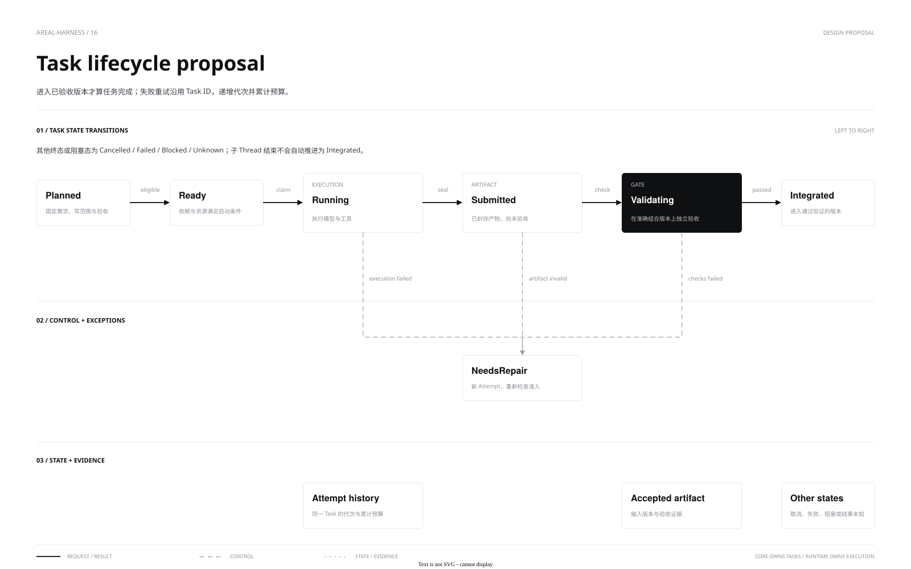

[中文](multi-agent.md) | **English**

# Agent delegation and admission

Default model tools `agent_spawn/read/wait/wait_any/report/send_input/cancel` reuse Core parent/child Turns and the cancellation tree. Each child receives explicit input and independent history while sharing workspace and deployment grants. Use [Workgroups](workgroups.en.md) for isolated writes and combined verification.

[Source](diagrams/task-lifecycle.drawio) · [Admission diagram](diagrams/agent-admission.svg) · [Admission source](diagrams/agent-admission.drawio)

## Ownership and settlement

Model-spawned children progress asynchronously. The parent receives results in completion order and joins all children before normal completion. Waiting holds no model or ordinary tool permit. Manually spawned RPC children retain cancellation when the parent Turn ends. Cancellation, timeout and failure propagate downward; terminal state follows resource closure and persistence.

`agent_report` persists summary, evidence and remaining work without ending the task. A failed task can hand back its latest report while retaining failure and partial markers; successful completion prefers a newer final reply. Checkpoints are not independent verification. Only the bound parent Turn controls a child; a completed child cannot start a detached Turn.

## Separate quotas

| Quota | Default and meaning |
|---|---|
| `max_threads` | 20000, including historical Thread metadata; archiving only releases hot history |
| `max_active_turns` | 256, including model queues, tool waits and cleanup |
| `model_concurrency` | 32, covering in-flight model requests only |
| `max_children_per_turn` | 64 successfully created direct children over the parent Turn; completion does not refund it |
| `max_agent_depth` | 8, with root depth 0; setting depth or fan-out to 0 disables delegation |

Child Thread and first Turn admission/persistence are atomic; rejection leaves no empty session. Capacity exhaustion rejects immediately rather than blocking a parent for space. Cleanup or final persistence failure retains active quota until Engine teardown and recovery. Restart validates ancestry without resuming execution automatically.

Tool availability does not guarantee delegation. Shared workspaces need nonoverlapping write responsibilities. Width, actual model-request overlap and task benefit are measured separately. Parameters, pagination and errors are in [Core API](../api/core.en.md#agent-tools).
