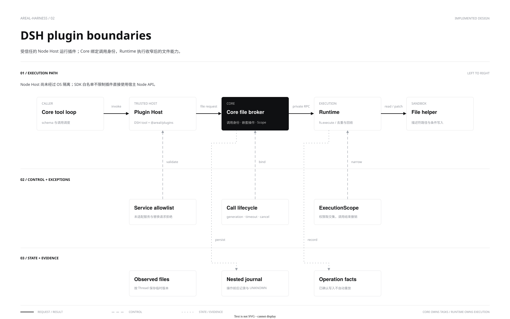

[中文](plugins.md) | **English**

# Plugin boundaries

`@areal/plugins` adapts selected DSH tools and filesystem services in a separate trusted Node Host. Core retains the agent loop, sessions, history commits and cancellation tree. Runtime retains deployment grants and execution facts. Plugins cannot replace these responsibilities.

[Source](diagrams/plugin-boundaries.drawio) · [PNG](diagrams/plugin-boundaries.png)

| Layer | Responsibility |
|---|---|
| SDK | Tool registration, text rendering, virtual file targets, observed versions and conditional writes |
| Node Host | Serial callbacks after initialization; transient observed-file versions per Thread |
| Core | Schemas, call identity, deadlines, hooks, nested journals and narrowed Scopes |
| Runtime | Managed file helper, path validation, deduplication and cleanup |

Only `tools/fs/sandboxPolicy` are adapted; the real editor is validated for `view/str_replace`. Full DSH Session, Prompt, Todo, Plan, Skill, Subagent, subprocess, event trees and provider replacement are unavailable. Files are limited to 32 KiB and combined results to 16 KiB.

Calls are serialized within each Host; different Hosts share Core tool limits. Cancellation, timeout, crash or protocol failure closes the generation. Successful nested writes survive outer failure; UNKNOWN stops automatic execution and requires inspection. Frozen SDK objects are not OS isolation: `trusted:true` must reflect actual trust.

[SDK contract](../api/typescript-sdk.en.md) · [Editor example](../examples/dsh-editor-plugin.en.md) · [Native Host v2 without DSH](../api/native-host.en.md)
