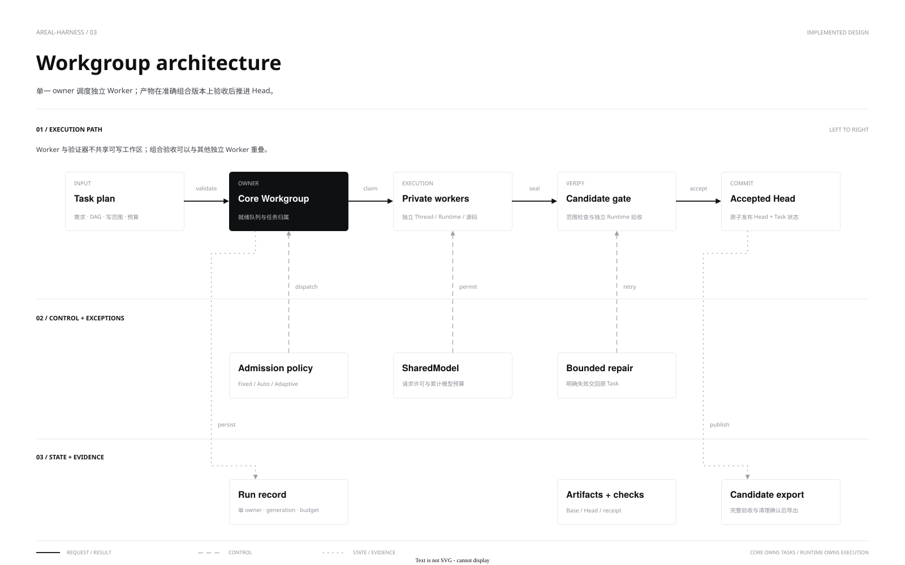

**中文** | [English](workgroups.en.md)

# Workgroup 调度与验收

Workgroup 使用生产 Engine 执行有界 DAG，为写任务和验证器建立独立 Runtime 与工作区。Core 拥有任务图、制品、修复和集成状态；Runtime 拥有权限与进程。使用入口见[指南](../guides/workgroups.md)。

[源文件](diagrams/workgroup-architecture.drawio) · [并发图](diagrams/workgroup-concurrency.svg) · [并发源文件](diagrams/workgroup-concurrency.drawio)

## 调度与产物

计划声明精确 writes、执行依赖 `depends` 和验收依赖 `integrationDepends`；两类边并集无环。共享写任务可合组，独立分支保留并行；任务合组与执行准入是两个控制层。

Worker 只提交允许路径的源码差异。验收使用可信工具链和准确候选树，检查验收本身未修改候选；局部通过再增量集成，最终完整检查通过才完成。验证回执绑定树摘要和 generation，旧结果不能授权新制品。

## 并发

| 模式 | 准入 |
|---|---|
| Fixed | 活动 Worker 不超过 W |
| Auto | 活动 Worker 不超过 W，未验收任务不超过 W+1 |
| Adaptive | 在 W 内调整目标 T，活动不超过 T，未验收不超过 T+1 |

Adaptive 根据本地模型许可排队、占用与验收积压调整后续派发，不取消已运行 Worker。默认按就绪宽度和模型池容量起步；显式 `initial-workers` 可覆盖。反馈不测量 GPU 或网关隐藏的 RPM/TPM，不承诺最优宽度。

嵌入服务在组之间共享 Worker、验证器和模型许可；组内预算仍独立。协调工具的等待不持有模型/执行许可，父 Turn 正常结束前自动汇总本 Turn 的组。客户端观察断连不取消已受理组。

## 失败与恢复

检查明确失败可在原写集合、修复次数和根预算内修复。只有工具结算、Runtime 关闭且未越界的模型失败，才能保留候选 checkpoint 供独立验收。UNKNOWN、权限错误和清理不明不进入自动恢复。

连续四个已观察边界中的成功操作、结果和源码均相同时，Worker 转入独立候选验收。比较忽略进程 ID、游标及 `remainingToolCalls` 调度元信息；调用余额递减不代表源码有进展。失败、输出不完整、参数或源码变化仍不满足这一条件。

任务失败阻塞依赖分支，独立分支可继续，但部分制品不算完整交付。重启保留历史并将未完成运行投影为 UNKNOWN，不认领旧进程或重放副作用。计划修改只影响尚未启动的任务或追加任务，不能删除原检查或扩大已冻结授权。状态、制品和控制接口见 [Core API](../api/core.md#workgroups)。
